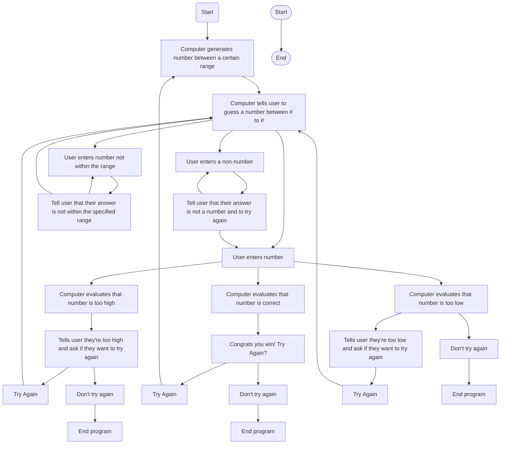

```mermaid
flowchart TD
    A(Start) --> B[Computer generates number between a certain range]
    B --> C[Computer tells user to guess a number between # to #]
    C --> D[User enters number]
    D --> E[Computer evaluates that number is too high]
    E --> H[Tells user they're too high and ask if they want to try again]
    H --> I[Try Again]
    I --> C
    H --> J[Don't try again]
    J --> K[End program]
    D --> F[Computer evaluates that number is correct]
    F --> L[Congrats you win! Try Again?]
    L --> M[Try Again]
    M --> B
    L --> N[Don't try again]
    N --> O[End program]
    D --> G[Computer evaluates that number is too low]
    G --> P[Tells user they're too low and ask if they want to try again]
    P--> Q[Try Again]
    Q --> C
    G --> R[Don't try again]
    R --> S[End program]
    C --> T[User enters a non-number]
    T --> U[Tell user that their answer is not a number and to try again]
    U --> D
    U --> T
    C --> V[User enters number not within the range]
    V --> W[Tell user that their answer is not within the specified range]
    W --> V
    W -->C 
    Start([Start]) --> End([End])
```    