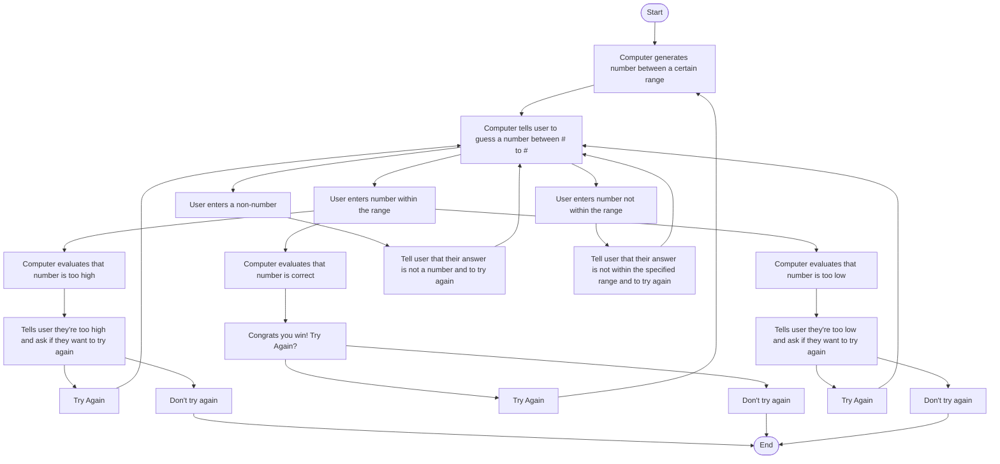

```mermaid
flowchart TD
    Start([Start]) --> A[Computer generates number between a certain range]
    A --> B[Computer tells user to guess a number between # to #]
    B --> C[User enters number within the range]
    C --> D[Computer evaluates that number is too high]
    D --> E[Tells user they're too high and ask if they want to try again]
    E --> F[Try Again]
    F --> B
    E --> J[Don't try again]
    J --> End([End])
    C --> K[Computer evaluates that number is correct]
    K --> L[Congrats you win! Try Again?]
    L --> M[Try Again]
    M --> A
    L --> N[Don't try again]
    N --> End([End])
    C --> O[Computer evaluates that number is too low]
    O --> P[Tells user they're too low and ask if they want to try again]
    P--> Q[Try Again]
    Q --> B
    P --> R[Don't try again]
    R --> End([End])
    B --> S[User enters a non-number]
    S --> T[Tell user that their answer is not a number and to try again]
    T --> B

    B --> U[User enters number not within the range]
    U --> V[Tell user that their answer is not within the specified range and to try again]
    V --> B 
```    